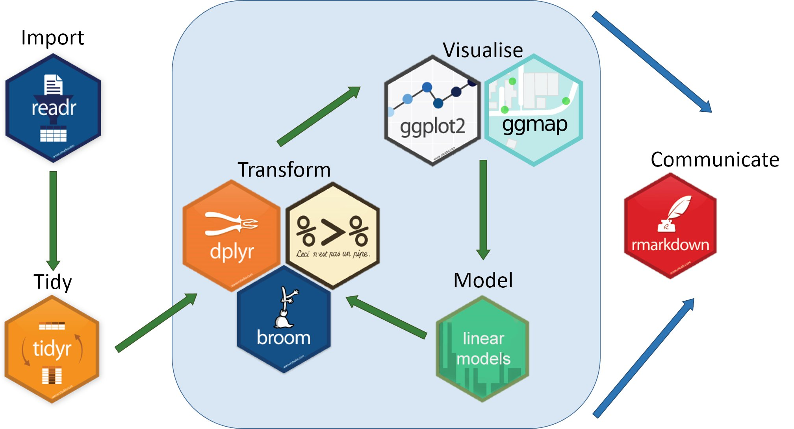

class: inverse, center, middle
# .font150[TEMARIO]

```{r setup, include=FALSE}
options(htmltools.dir.version = FALSE)
```

```{r xaringan-themer, warning=FALSE, include=FALSE}
library(xaringanthemer)

style_mono_accent(
  base_color       = "#E94B4F",
  padding          = "16px 50px 12px 50px",
  code_font_google = google_font("Fira Mono")
)

```

```{r xaringanExtra, echo=FALSE}
#devtools::install_github("gadenbuie/xaringanExtra")
library(xaringanExtra)

xaringanExtra::use_xaringan_extra(c("tile_view", "tachyons", "panelset"))

xaringanExtra::use_tile_view()

xaringanExtra::use_editable()

xaringanExtra::use_scribble()

xaringanExtra::use_logo(
  image_url ="imagenes/logo.png", 
  link_url = "https://medicionpsicologica.com",
  width = 120, 
  height = 120
  )

xaringanExtra::use_clipboard(
  button_text = "Copiar",
  success_text = "Copiado",
  error_text = "Presiona Ctrl+C para copiar"
)

xaringanExtra::use_fit_screen()

xaringanExtra::use_extra_styles(
  hover_code_line = TRUE,          #<<
  mute_unhighlighted_code = FALSE  #<<
)

```

---

## ¿Qué veremos hoy?

.pull-left[
1. **VISUALIZACIÓN DE DATOS** 
 * Definición
 * Importancia
 * Visualización de datos con R
 
2. **GRAMÁTICA DE GRÁFICOS**
 * Capas básicas
 * Capas de personalización
 
3. **ILUSTRACIÓN**
 * Base de datos
 * Gráfico de barras
 * Histograma
 * Diagrama de cajas y bigotes
 
4. **PRÁCTICA**
]

.pull-right[
```{r, out.width = "100%", echo = FALSE}
knitr::include_graphics("imagenes/ampi.png", dpi = 600)
```
]


---

class: inverse, center, middle
# .font150[VISUALIZACIÓN DE DATOS]

---

## ¿Qué es la visualización de datos?
.font105[Algunas **definiciones** (Cairo, 2016).]

.panelset[
.panel[.panel-name[Visualización]

#### 1. Definición

.pull-left[
**Visualización** es un tipo de representación visual de información diseñada para permitir la comunicación, el análisis, el descubrimiento, la exploración, etc.

]

.pull-right[
<div>
<p style = 'text-align:center;'>


]
]

.panel[.panel-name[Gráfico]

#### 2. Definición


.pull-left[
Un **gráfico** (chart o plot como sinónimos) es una representación en la que los datos se codifican con símbolos que tienen diferentes formas, colores o proporciones.]

.pull-right[
```{r, out.width = "100%", echo = FALSE}
knitr::include_graphics("imagenes/0.2.PNG", dpi = 600)
```
]

]

.panel[.panel-name[Mapa]

#### 3. Definición

.pull-left[
Un **mapa** es una representación de un área geográfica o una representación de los datos que pertenecen a esa área geográfica.]

.pull-right[
```{r, out.width = "100%", echo = FALSE}
knitr::include_graphics("imagenes/0.3.PNG", dpi = 600)
```
]

]

.panel[.panel-name[Infografía]

#### 4. Definición

.pull-left[Una **infografía** es una representación visual multiseccional de información con la intención de comunicar uno o más mensajes específicos. Son una mezcla de gráficos, mapas, ilustraciones y texto que brinda explicación y contexto.
]

.pull-right[
```{r, out.width = "100%", echo = FALSE}
knitr::include_graphics("imagenes/0.4.PNG", dpi = 600)
```
]


]

.panel[.panel-name[Visualización de datos]

#### 5. Definición

.pull-left[
-	Representación de datos diseñada para permitir el análisis, la exploración y el descubrimiento.

-	No busca transmitir mensajes predefinidos por sus diseñadores.

-	Herramienta que permite a las personas extraer sus propias conclusiones de los datos.

]

.pull-right[
<div>
<p style = 'text-align:center;'>

]

]
]

---

##¿Por qué es importante visualizar los datos? (Healy, 2019)

- Diferente distribución, mismo coeficiente de correlación.
- Análisis de distribución de los datos y corroborar si cumple los supuestos fundamentales de las técnicas estadísticas.

.pull-left[
```{r, out.width = "70%", echo = FALSE}
knitr::include_graphics("imagenes/1.PNG", dpi = 500)
```
]

.pull-right[
```{r, out.width = "60%", echo = FALSE}
knitr::include_graphics("imagenes/2.PNG", dpi = 500)
```
]

---

##¿Por qué es importante conocer sobre visualización de datos? 

####Para entender los errores comunes en la construcción de gráficos y evitarlos en el futuro (Healy, 2019).

.panelset[
.panel[.panel-name[El mal gusto]

Utilizar excesivos elementos gráficos que dificultan la interpretación.

```{r, out.width = "70%", echo = FALSE}
knitr::include_graphics("imagenes/3.PNG", dpi = 500)
```

]

.panel[.panel-name[Datos errados 1]

Forzar la interpretación de los datos a intereses particulares.


```{r, out.width = "90%", echo = FALSE}
knitr::include_graphics("imagenes/4.PNG", dpi = 500)
```
]

.panel[.panel-name[Datos errados 2]

Forzar la interpretación de los datos a intereses particulares.


```{r, out.width = "80%", echo = FALSE}
knitr::include_graphics("imagenes/5.PNG", dpi = 500)
```
]

.panel[.panel-name[Problemas de percepción]

La forma y el color que se elija pueden ser claves.


```{r, out.width = "95%", echo = FALSE}
knitr::include_graphics("imagenes/6.PNG", dpi = 500)
```
]
]

---

# Visualización de datos con R

.panelset[
.panel[.panel-name[Herramientas]

.pull-left[
#### a) Interfaz gráfica: 
- [Power BI](https://powerbi.microsoft.com/es-es/)

- [Flourish](https://flourish.studio/)

- [Tableau](https://www.tableau.com/)


]

.pull-right[
#### b) Programación:
- [R](https://www.r-project.org/)

- [Python](https://www.python.org/)


]

]

.panel[.panel-name[Ventajas de R]

Las principales ventajas de usar R para la visualización de datos son: 

.pull-left[
- **Reproducibilidad** 

- **Transparencia**

- **Personalización**
]

.pull-right[

####Iniciativas colaborativas:
[#30díasdegráficos con R](https://github.com/cienciadedatos/datos-de-miercoles/blob/master/30-dias-de-graficos-2020.md)

<div>
<p style = 'text-align:center;'>

</p>
</div>

]
]

.panel[.panel-name[Ejemplos]

[BBC](https://medium.com/bbc-visual-and-data-journalism/how-the-bbc-visual-and-data-journalism-team-works-with-graphics-in-r-ed0b35693535) es una de las diferentes organizaciones que viene empleando R para la elaboración de sus gráficos. Para ello incluso ha creado un paquete denominado [bbplot](https://github.com/bbc/bbplot?fbclid=IwAR33xLEqbnMtBtNcBxWIz_2BserkV53TAyp44828yTxf_HzZmUU0QeWTgW8)

<div>
<p style = 'text-align:center;'>

</p>
</div>

]


.panel[.panel-name[Paquetes]

Para crear visualizaciones se utiliza el paquete `ggplot2` y una serie de extensiones tales como:

- patchwork
- gganimate
- ggplotly
- ggridges
- ggtext
- ggrepel
- ggstatsplot

]
]

---
class: inverse, center, middle
# .font150[GRAMÁTICA DE GRÁFICOS]

---

class: inverse

background-image:url(https://pbs.twimg.com/media/EQ-uBWcX0AIc_bs.png)
background-size: cover   

---

# Capas básicas

.pull-left[
Un gráfico esta compuesto **mínimamente** por tres capas: 
- Datos
- Coordenadas
- Geometría
]

.pull-right[
```{r echo = FALSE, out.width = "100%"}
knitr::include_graphics("imagenes/ggplot2_capas_básicas.png", dpi = 500)
```
]

---

.panelset[
.panel[.panel-name[Paso 0]

### Paso 0. Cargar paquete 

.font105[.line-space1-3[
`Tidyverse` es un ecosistema de paquetes, entre los cuales se encuentra `ggplot2`]]

```{r message = FALSE, warning = FALSE}
library(tidyverse)                
```

<div>
<p style = 'text-align:center;'>

</p>
</div>

]


.panel[.panel-name[Paso 1]

### Paso 1. Base de datos
.font105[.line-space1-3[
El primer argumento refiere a la data, en este caso trabajaremos con `iris`]]

.pull-left[
```{r, eval = FALSE}
ggplot(data = iris) 
```
]

.pull-right[
```{r echo = FALSE, fig.height = 5.5, fig.width = 5.5, fig.align = "center"}
ggplot(data = iris)
```
]
]

.panel[.panel-name[Paso 2]

### Paso 2. Coordenadas 
.font105[.line-space1-3[
El segundo argumento son las coordenadas, para ello colocamos `aes`]]

.pull-left[
```{r, eval = FALSE}
ggplot(data = iris,
       aes(x = Petal.Length,   #<<
           y = Sepal.Length))  #<<
```
]

.pull-right[
```{r echo = FALSE, fig.height = 5.5, fig.width = 5.5, fig.align = "center"}
ggplot(data = iris,
       aes(x = Petal.Length,
           y = Sepal.Length))  
```
]
]

.panel[.panel-name[Paso 3]

### Paso 3. Geometrías
.font105[.line-space1-3[
El tercer argumento refiere a las geometrías, para ello agregamos una capa y colocamos `geom`]]

.pull-left[
```{r, eval = FALSE}
ggplot(data = iris,
       aes(x = Petal.Length,
           y = Sepal.Length)) +
       geom_point()             #<<
```
]

.pull-right[
```{r echo = FALSE, fig.height = 5.5, fig.width = 5.5, fig.align = "center"}
ggplot(data = iris,
       aes(x = Petal.Length,
           y = Sepal.Length)) +
       geom_point()
```
]
]
]

---
class: inverse, center, middle
# .font50[Una vez se cuenta con las 3 capas básicas, se puede agregar otras para personalizar más el gráfico]

---

.panelset[
.panel[.panel-name[Paso 4]

### Paso 4. Color (Parte de Estéticas)
.font105[.line-space1-3[
Con `aes`, además de las coordenadas, se puede colorear el gráfico. En este caso, coloreamos según **especies**
]]
.pull-left[
```{r, eval = FALSE}
ggplot(data = iris,
       aes(x = Petal.Length,
           y = Sepal.Length,
           colour = Species)) +  #<<
       geom_point()
```
]

.pull-right[
```{r echo = FALSE, fig.height = 5, fig.width = 5, fig.align = "center"}
ggplot(data = iris,
       aes(x = Petal.Length,
           y = Sepal.Length,
           colour = Species)) +
       geom_point()
```
]
]

.panel[.panel-name[Paso 5]

### Paso 5. Temas
.font105[.line-space1-3[
El cuarto argumento refiere a los temas o formatos de la gráfica, para ello agregamos una capa  y colocamos `theme`
]]
.pull-left[
```{r, eval = FALSE}
ggplot(data = iris,
       aes(x = Petal.Length,
           y = Sepal.Length,
           colour = Species)) +
       geom_point() +
       theme_classic()         #<<
```
]

.pull-right[
```{r echo = FALSE, fig.height = 5, fig.width = 5, fig.align = "center"}
ggplot(data = iris,
       aes(x = Petal.Length,
           y = Sepal.Length,
           colour = Species)) +
       geom_point() +
       theme_classic()
```
]
]

.panel[.panel-name[Paso 6]

### Paso 6. Etiquetas
.font105[.line-space1-3[
El quinto argumento refiere a las etiquetas, para ello agregamos una capa y colocamos `labs`. En ella podemos específicar el título, subtítulo, leyenda, y otros.
]]

.pull-left[
```{r, eval = FALSE}
ggplot(data = iris,
       aes(x = Petal.Length,
           y = Sepal.Length,
           colour = Species)) +
       geom_point() +
       theme_classic() +
       labs(                                        #<<
       title = "Distribución de las especies",      #<<
       subtitle = "Gráfica propia"                  #<<
       caption  = "Avances en Medición Psicólogica" #<<
       )                                            #<<
```
]

.pull-right[
```{r echo = FALSE, fig.height = 5, fig.width = 5, fig.align = "center"}
ggplot(data = iris,
       aes(x = Petal.Length,
           y = Sepal.Length,
           colour = Species)) +
       geom_point() +
       theme_classic() +
       labs(                                    
       title = "Distribución de las especies",  
       subtitle = "Gráfica propia",      
       caption  = "Avances en Medición Psicólogica"
       )                                      
```
]
]
]

---
class: inverse, center, middle
# .font150[ILUSTRACIÓN]

---
# .font100[Características de la base de datos]

.font105[.line-space1-5[
La base de datos (data) fue extraida de una investigación que tenía por objetivo correlacionar las variables `Autoeficacia Académica (AA)` y el `Burnout (B)` en estudiantes de enfermería ]]

```{r, out.width = "100%", echo = FALSE, message=FALSE}

data <- readxl::read_excel("data3_clean.xlsx")
variables <- readxl::read_excel("variables.xlsx")

DT::datatable(variables, options = list(pageLength = 5))
```

---

class: inverse, center, middle
# .font150[Gráfico de barras]

---
# .font100[Definición]


.pull-left[
Los gráficos de barras permiten resumir un conjunto de datos según una **categoría** por ejemplo según fechas, sexo, países, regiones, entre otros. 

La figura muestra las proporciones medias de `variantes de COVID-19` en los distintos países entre enero de 2020 y abril de 2021. 

La imagen puede apreciarse de forma más detallada en el siguiente link (https://ars.els-cdn.com/content/image/1-s2.0-S0033350621003073-gr1.jpg)
]


.pull-right[
```{r, out.width = "100%", echo = FALSE}
knitr::include_graphics("imagenes/articulo_barras.jpg", dpi = 500)
```
]

.pull-right[
El gráfico fue extraido de la investigación **The real life impact of vaccination on COVID-19 mortality in Europe and Israel** (https://doi.org/10.1016/j.puhe.2021.07.037). 
]

---
class: inverse, center, middle
# .font100[Diferencias entre geom_bar() y geom_col()]

---
.pull-left[
**geom_bar()** hace que la altura de la barra sea proporcional al número de casos en cada grupo (o si se suministra la estética del peso, la suma de los pesos). Utiliza stat_count() por defecto, cuenta el número de casos en cada posición x.

```{r echo = FALSE}
data %>% 
  ggplot(aes(x = ase_cat)) + 
  geom_bar()
```

]

.pull-right[
**geom_col** hace que la altura de la barra represente el valor de los datos. Así mismo utiliza stat_identity() por lo que deja los datos como están. Siendo necesario agregar la función count() para hallar la cantidad de casos para cada barra. 

```{r echo = FALSE}
data %>% 
  count(ase_cat) %>% 
  mutate(
    ase_cat = factor(ase_cat),
    n = factor(n)
  ) %>% 
  ggplot(aes(y = n,               
             x = ase_cat)) +
  geom_col()
```
]

---

class: inverse, center, middle
# .font100[Gráfico de barras con geom_bar()]
---

.panelset[
.panel[.panel-name[Paso 1]

#### 1. Coordenadas

.font105[.line-space1-5[
Al usar la función `%>%` lo primero que colocaremos antes de crear cualquier código es la base de datos que en este caso se llama `data`. Posteriormente incluiremos la función **ggplot()** la cual crea el sistema de coordenadas y especifica las coordenadas con `aes`. Para la gráfica en el eje "x" utilizaremos la variable categórica `ase_cat`
]]

.pull-left[
```{r, eval = FALSE}
data %>%                             
  ggplot(aes(x = ase_cat))  #<< 
```
]

.pull-right[
```{r echo = FALSE}
data %>%                             
  ggplot(aes(x = ase_cat))
```
]
]

.panel[.panel-name[Paso 2]

#### 2. Geometrías

.font105[.line-space1-5[
Luego de especificar las coordenadas del gráfico definimos la geométria a utilizar, para ello agregaremos una capa **(con el símbolo +) ** y utilizaremos la geometría **geom_bar**
]]

.pull-left[
```{r, eval = FALSE}
data %>%                             
  ggplot(aes(x = ase_cat)) +  
  geom_bar()                 #<<
```
]

.pull-right[
```{r echo = FALSE}
data %>% 
  ggplot(aes(x = ase_cat)) + 
  geom_bar()
```
]
]

.panel[.panel-name[Paso 3]

#### 3. Colores

.font105[.line-space1-5[
Si bien `aes` permite definir las coordenadas del gráfico, también permite incluir funciones para personalizar el gráfico. Incluyendo el argumento `colour` podemos colorear los bordes de la barra e incluyendo el argumento `fill` podemos especificar un color para el relleno del gráfico.

]]

.pull-left[
```{r, eval = FALSE}
data %>% 
  ggplot(aes(x = ase_cat)) + 
  geom_bar(colour = "black",     #<<
           fill = "grey")        #<<
```
]

.pull-right[
```{r echo = FALSE}
data %>% 
  ggplot(aes(x = ase_cat)) + 
  geom_bar(colour = "black",
           fill = "grey") 
```

]
]

.panel[.panel-name[Paso 4]

#### 4. Tema

.font105[.line-space1-5[
El **tema** es un argumento que le da un formato al fondo y el marco de la gráfica. 

]]

.pull-left[
```{r, eval = FALSE}
data %>% 
  ggplot(aes(x = ase_cat)) + 
  geom_bar(colour = "black",     
           fill = "grey") + 
  theme_bw()                     #<<
```
]

.pull-right[
```{r echo = FALSE}
data %>% 
  ggplot(aes(x = ase_cat)) + 
  geom_bar(colour = "black",
           fill = "grey") + 
  theme_bw()
```

]
]

.panel[.panel-name[Paso 5]

#### 5. Etiquetas del gráfico

.font105[.line-space1-5[
Al culminar el gráfico se pueden colocar titulos, subtitulos y leyenda.

]]

.pull-left[
```{r, eval = FALSE}
data %>% 
  ggplot(aes(x = ase_cat)) + 
  geom_bar(colour = "black",
           fill = "grey") +
  theme_bw() + 
  labs(                                             #<<
    title = "Nivel de ansiedad",                    #<<
    subtitle = "Gráfica propia",                    #<<
    caption = "Avances en Medición Psicológica")    #<<           
```
]

.pull-right[
```{r echo = FALSE}
data %>% 
  ggplot(aes(x = ase_cat)) + 
  geom_bar(colour = "black",
           fill = "grey") +
  theme_bw() + 
  labs(                                             
    title = "Nivel de ansiedad",                    
    subtitle = "Gráfica propia",                    
    caption = "Avances en Medición Psicológica")    
```

]
] 
] 

---
class: inverse, center, middle
# .font100[Gráfico de barras con geom_col()]

---

.panelset[
.panel[.panel-name[Paso 1]

#### 1. Conteo de variables

.font105[.line-space1-5[
Para utilizar **geom_col** primero realizaremos el conteo de la variable que luego será graficada. Para ello se utilizaran las funciones `count()`, `mutate()` y `factor()`. 
]]

.pull-left[
```{r, eval = FALSE}
data %>%                             
  count(ase_cat) %>%             #<<
  mutate(                        #<<
    ase_cat = factor(ase_cat),   #<<
          n = factor(n)          #<<
  )                              #<<
```
]

.pull-right[
```{r echo = FALSE}
data %>% 
  count(ase_cat) %>% 
  mutate(
    ase_cat = factor(ase_cat),
          n = factor(n)
  )
```
]

]

.panel[.panel-name[Paso 2]

#### 2. Coordenadas

.font105[.line-space1-5[
Con el argumento `aes`, señalaremos el contenido del eje horizontal (x) y vertical (y)
]]

.pull-left[
```{r, eval = FALSE}
data %>% 
  count(ase_cat) %>% 
  mutate(
    ase_cat = factor(ase_cat),
          n = factor(n)
  ) %>% 
  ggplot(aes(y = n,           #<<
             x = ase_cat))    #<<
```
]


.pull-right[
```{r echo = FALSE, fig.retina = 3}
data %>% 
  count(ase_cat) %>% 
  mutate(
    ase_cat = factor(ase_cat),
          n = factor(n)
  ) %>% 
  ggplot(aes(y = n,                 
             x = ase_cat))    
```
]

]

.panel[.panel-name[Paso 3]

#### 3. Geometrías

.font105[.line-space1-5[
Agregamos una capa **(con el símbolo +)** para agregar el argumento de la geometría **geom_col**.
]]

.pull-left[
```{r, eval = FALSE}
data %>% 
  count(ase_cat) %>% 
  mutate(
    ase_cat = factor(ase_cat),
          n = factor(n)
  ) %>% 
  ggplot(aes(y = n,            
             x = ase_cat)) +   
  geom_col()                   #<<       
```
]

.pull-right[
```{r echo = FALSE, fig.retina = 3}
data %>% 
  count(ase_cat) %>% 
  mutate(
    ase_cat = factor(ase_cat),
          n = factor(n)
  ) %>% 
  ggplot(aes(y = n,            
             x = ase_cat)) +   
  geom_col()
```
]
]


.panel[.panel-name[Paso 4A]

#### 4. Colores del gráfico

.font105[.line-space1-5[
Dentro de la función de `aes` agregaremos el argumento `fill` y en este caso, coloreamos según **ase_cat**
]]
.pull-left[
```{r, eval = FALSE}
data %>% 
  count(ase_cat) %>% 
  mutate(
    ase_cat = factor(ase_cat),
          n = factor(n)
  ) %>% 
  ggplot(aes(y = n,               
             x = ase_cat,         
          fill = ase_cat)) +      #<<
  geom_col()
```
]


.pull-right[
```{r echo = FALSE, fig.retina = 3}
data %>% 
  count(ase_cat) %>% 
  mutate(
    ase_cat = factor(ase_cat),
          n = factor(n)
  ) %>% 
  ggplot(aes(y = n,             
             x = ase_cat,       
          fill = ase_cat)) +    
  geom_col()
```
]
]

.panel[.panel-name[Paso 4B]

#### 4.1 Colores del gráfico

.font105[.line-space1-5[
También podemos colorearemos el gráfico según otra variable categórica, por ejemplo según la variable **sexo**.
]]

.pull-left[
```{r, eval = FALSE}
data %>% 
  count(ase_cat, sexo) %>% 
  mutate(
    ase_cat = factor(ase_cat),  
          sexo = factor(sexo)   
  ) %>% 
  ggplot(aes(y = n,             
             x = ase_cat,          
             fill = sexo)) +       #<<
  geom_col()                          
       
```
]


.pull-right[
```{r echo = FALSE, fig.retina = 3}
data %>% 
  count(ase_cat, sexo) %>% 
  mutate(
    ase_cat = factor(ase_cat),  
          sexo = factor(sexo)   
  ) %>% 
  ggplot(aes(y = n,             
             x = ase_cat,       
             fill = sexo))  +
  geom_col() 
```
]
]

.panel[.panel-name[Paso 5]

#### 5. Temas

.font105[.line-space1-5[
Los temas permiten establecer un fondo a la gráfica, para ello agregamos una capa  y colocamos `theme`
]]
.pull-left[
```{r, eval = FALSE}
data %>% 
  count(ase_cat) %>% 
  mutate(
    ase_cat = factor(ase_cat),
          n = factor(n)
  ) %>% 
  ggplot(aes(y = n,            
             x = ase_cat,      
          fill = ase_cat)) +   
  geom_col() +
  theme_minimal()                   #<< 
```
]


.pull-right[
```{r echo = FALSE}
data %>% 
  count(ase_cat) %>% 
  mutate(
    ase_cat = factor(ase_cat),
          n = factor(n)
  ) %>% 
  ggplot(aes(y = n, x = ase_cat,
             fill = ase_cat)) +
  geom_col() + 
  theme_minimal()
```
]
]

.panel[.panel-name[Paso 6]

#### 6. Etiquetas en la barra

.font105[.line-space1-5[
Las etiquetas en la barra permiten denotar la altura de la barra. Para incluir las etiquetas agregamos el argumento `geom_label()`. En ella especificaremos el contenido de la etiqueta.
]]
.pull-left[
```{r, eval = FALSE}
data %>% 
  count(ase_cat) %>%                         
  mutate(
    ase_cat = factor(ase_cat),
          n = factor(n)
  ) %>% 
  ggplot(aes(y = n, 
             x = ase_cat,
          fill = ase_cat)) +
  geom_col() + 
  theme_minimal() +
  geom_label(aes(label = n),                 #<<
  position = position_stack(vjust = 0.5))     #<<
```
]


.pull-right[
```{r echo = FALSE}
data %>% 
  count(ase_cat) %>%                         
  mutate(
    ase_cat = factor(ase_cat),
          n = factor(n)
  ) %>% 
  ggplot(aes(y = n, 
             x = ase_cat,
          fill = ase_cat)) +
  geom_col() + 
  theme_minimal() +
  geom_label(aes(label = n),                         
  position = position_stack(vjust = 0.5))                                   
```
]
]

.panel[.panel-name[Paso 7]

#### 7. Etiquetas en el gráfico

.font105[.line-space1-5[
Este argumento permite agregar etiquetas como el titulo, el subtitulo y la leyenda. Para ello utilizaremos el argumento `labs` con la cual especificaremos el contenido de cada etiqueta.
]]
.pull-left[
```{r, eval = FALSE}
data %>% 
  count(ase_cat) %>% 
  mutate(
    ase_cat = factor(ase_cat),
          n = factor(n)
  ) %>% 
  ggplot(aes(y = n, 
             x = ase_cat,
          fill = ase_cat)) +
  geom_col() + 
  theme_minimal() +
  geom_label(aes(label = n),                         
             position = position_stack(vjust = 0.5)) +
  labs(                                           #<<
  title = "Nivel de ansiedad",                    #<<
  subtitle = "Gráfica propia",                    #<<
  caption = "Avances en Medición Psicológica")    #<<
```
]


.pull-right[
```{r echo = FALSE}
data %>% 
  count(ase_cat) %>% 
  mutate(
    ase_cat = factor(ase_cat),
          n = factor(n)
  ) %>% 
  ggplot(aes(y = n, 
             x = ase_cat,
          fill = ase_cat)) +
  geom_col() + 
  theme_minimal() +
  geom_label(aes(label = n),                         
             position = position_stack(vjust = 0.5)) +
  labs(                                           #<<
  title = "Nivel de ansiedad",                    #<<
  subtitle = "Gráfica propia",                    #<<
  caption = "Avances en Medición Psicológica")    #<<
        
```
]
]
]

---

## ¡Nos vemos en 10 minutos!

```{r, out.width = "100%", echo = FALSE}
library(countdown)
countdown(minutes = 10,
          left = 0, right = 0,
          top = 5,
          padding = "50px",
          margin = "5%",
          font_size = "6em",
          play_sound = TRUE)
```

---

class: inverse, center, middle
# .font100[Histograma]

---

# HISTOGRAMA
.font105[**Descripción general (Harris, 1999; Zedeck, 2013)**]

.panelset[
.panel[.panel-name[Definición]


Representación gráfica de datos continuos mediante barras de altura variable, similar a un GRÁFICO DE BARRAS, pero con bloques en el eje X; contiguos entre sí para denotar su naturaleza continua.

<div>
<p style = 'text-align:center;'>
```{r, out.width = "43%", echo = FALSE}
knitr::include_graphics("imagenes/0.5.0.png", dpi = 500)
```
]
]

.panel[.panel-name[Proceso 1]

####1. Dado un conjunto de datos:

```{r, out.width = "100%", echo = FALSE}
knitr::include_graphics("imagenes/Histo_1.PNG", dpi = 500)
```
]

.panel[.panel-name[Proceso 2]

####2. Los datos datos representados en una coordenada.

```{r, out.width = "100%", echo = FALSE}
knitr::include_graphics("imagenes/Histo_2.PNG", dpi = 500)
```
]

.panel[.panel-name[Proceso 3]

####3. Se forman intervalos de clase con la misma amplitud y se contabilizan los datos de cada intervalo de clase.

```{r, out.width = "100%", echo = FALSE}
knitr::include_graphics("imagenes/Histo_3.PNG", dpi = 500)
```
]

.panel[.panel-name[Proceso 4]

####4.	Introducción de columnas en cada uno de los intervalos de clase.

```{r, out.width = "100%", echo = FALSE}
knitr::include_graphics("imagenes/Histo_4.PNG", dpi = 500)
```

]

.panel[.panel-name[Intervalos de clase]

Rango de puntuaciones o valores numéricos que constituyen un segmento o clase de una variable de interés. 

####Amplitud de intervalo de clase, Regla de Sturges


```{r, out.width = "120%", echo = FALSE}
knitr::include_graphics("imagenes/Histogram_1.PNG", dpi = 500)
```
- R = Rango, la diferencia entre el mayor y menor valor del conjunto de datos
- k = número de intervalos de clase
- N = número de valores en el conjunto de datos en observación

]
]

---

# HISTOGRAMA
.font105[**Presentación básica de un histograma en R**]

.panelset[
.panel[.panel-name[Paso 1]

#### 1. Cargar paquetes

- `tidyverse` y `patchwork`

```{r warning=FALSE, message=FALSE}
library(tidyverse)
library(patchwork)
```

.panel[.panel-name[Paso 2]

#### 2. Importar datos.

.font105[
```{r warning=FALSE, message=FALSE, eval=FALSE}
data <- readxl::read_xlsx("data3_clean.xlsx")
```
]
]

.panel[.panel-name[Paso 3]

#### 3. Cargar datos en ggplot.

.pull-left[
```{r, eval = FALSE}
ggplot(data)
```
]

.pull-right[
```{r echo = FALSE, out.width = "70%"}
ggplot(data)
```
]
]

.panel[.panel-name[Paso 4]

#### 4. Indicar la variable de análisis con aes.

.pull-left[
```{r, eval = FALSE}
ggplot(data, aes(x = ase_total)) 
```
]

.pull-right[
```{r echo = FALSE, out.width = "70%"}
ggplot(data, aes(x = ase_total)) 
```
]
]

.panel[.panel-name[Paso 5]

#### 5. Señalar que se trabajará con un gráfico de histograma.

.pull-left[
```{r, eval = FALSE}
ggplot(data, aes(x = ase_total)) +
  geom_histogram()
```
]

.pull-right[
```{r echo=FALSE, message=FALSE, out.width="70%"}
ggplot(data, aes(x = ase_total)) +
  geom_histogram()
```
]

]
]
]


---
# HISTOGRAMA
.font105[**Personalización de un histograma**]

.panelset[
.panel[.panel-name[Paso 6]

#### 6. Amplitud de intervalo utilizando la regla de Sturges `function(x) (max(x)-min(x))/nclass.Sturges(x)`.

.pull-left[
```{r, eval = FALSE}
ggplot(data, aes(x = ase_total)) +
  geom_histogram(binwidth = 7))
```


```{r, eval = FALSE}
ggplot(data, aes(x = ase_total)) +
  geom_histogram(binwidth = function(x) (max(x)-min(x))/nclass.Sturges(x))
```

]

.pull-right[
```{r echo = FALSE, out.width = "70%"}
ggplot(data, aes(x = ase_total)) +
  geom_histogram(
    binwidth = function(x) (max(x)-min(x))/nclass.Sturges(x))
```
]
]

.panel[.panel-name[Paso 7]

####7. Color y relleno.

.pull-left[
```{r, eval = FALSE}
ggplot(data, aes(x = ase_total)) +
  geom_histogram(binwidth = function(x) (max(x)-min(x))/nclass.Sturges(x),
                 color = "black",
                 fill = "skyblue")
```
]

.pull-right[
```{r echo = FALSE, out.width = "70%"}
ggplot(data, aes(x = ase_total)) +
  geom_histogram(binwidth = function(x) (max(x)-min(x))/nclass.Sturges(x),
                 color = "black",
                 fill = "skyblue")
```
]
]


.panel[.panel-name[Paso 8]

#### 8. Tema.

.pull-left[
```{r, eval = FALSE}
ggplot(data, aes(x = ase_total)) +
  geom_histogram(binwidth = function(x) (max(x)-min(x))/nclass.Sturges(x),
                 color = "black",
                 fill = "skyblue") +
  theme_classic()
```
]

.pull-right[
```{r echo = FALSE, out.width = "70%"}
ggplot(data, aes(x = ase_total)) +
  geom_histogram(binwidth = function(x) (max(x)-min(x))/nclass.Sturges(x),
                 color = "black",
                 fill = "skyblue") +
  theme_classic()
```
]
]

.panel[.panel-name[Paso 9]

#### 9. Anotaciones `labs`.


.pull-left[
```{r, eval = FALSE}
ggplot(data, aes(x = ase_total)) +
  geom_histogram(binwidth = function(x) (max(x)-min(x))/nclass.Sturges(x),
                 color = "black",
                 fill = "skyblue") + 
  labs(
    title = "Distribución de puntajes de Autoeficacia Académica",
    subtitle = "Base de datos de Rohmani & Andriani (2021)",
    x = "Autoeficacia Académica",
    y = "Frecuencia",
    caption  = "Avances en Medición Psicológica") +
  theme_classic()
```
]

.pull-right[
```{r echo = FALSE, out.width = "70%"}
ggplot(data, aes(x = ase_total)) +
  geom_histogram(binwidth = function(x) (max(x)-min(x))/nclass.Sturges(x),
                 color = "black",
                 fill = "skyblue") + 
  labs(
    title = "Distribución de puntajes de Autoeficacia Académica",
    subtitle = "Base de datos de Rohmani & Andriani (2021)",
    x = "Autoeficacia Académica",
    y = "Frecuencia",
    caption  = "Avances en Medición Psicológica") +
  theme_classic()
```
]

]

.panel[.panel-name[Paso 10]

#### 10. Utilizar facet_wrap para visualizar los resultados según un tipo de variable categórica.

.pull-left[
```{r, eval = FALSE}
ggplot(data, aes(x = ase_total)) +
  geom_histogram(binwidth = function(x) (max(x)-min(x))/nclass.Sturges(x),
                 color = "black",
                 fill = "skyblue") + 
  labs(
    title = "Distribución de puntajes de Autoeficacia Académica según el sexo",
    subtitle = "Base de datos de Rohmani & Andriani (2021)",
    x = "Autoeficacia Académica",
    y = "Frecuencia",
    caption  = "Avances en Medición Psicológica") +
  facet_wrap(vars(sexo)) + 
  theme_classic()
```
]

.pull-right[
```{r echo = FALSE, out.width = "70%"}
ggplot(data, aes(x = ase_total)) +
  geom_histogram(binwidth = function(x) (max(x)-min(x))/nclass.Sturges(x),
                 color = "black",
                 fill = "skyblue") + 
  labs(
    title = "Distribución de puntajes de Autoeficacia Académica según el sexo",
    subtitle = "Base de datos de Rohmani & Andriani (2021)",
    x = "Autoeficacia Académica",
    y = "Frecuencia",
    caption  = "Avances en Medición Psicológica") +
  facet_wrap(vars(sexo)) + 
  theme_classic()
```
]
]
]

---
class: inverse, center, middle
# .font100[Diagrama de cajas y bigotes]

---

### BOXPLOT ¿Cómo interpretarlo?
.font105[.line-space1-3[
La caja de un boxplot comienza en el primer cuartil (Q1) y termina en el tercero (Q3). Por lo tanto, **la caja representa el 50% de los datos centrales**, con una línea dentro que representa la mediana. A cada lado de la caja se dibuja un segmento con los datos más lejanos sin contar los valores atípicos (outliers) del box plot, que en caso de existir, se representarán con círculos.
]]

```{r, out.width = "100%", echo = FALSE}
knitr::include_graphics("imagenes/boxplot.png", dpi = 1000)
```


---

.panelset[
.panel[.panel-name[Paso 1]

### Paso 1. Base de datos
.font105[.line-space1-3[
El primer argumento refiere a la data, en este caso trabajaremos con `data` que previamente fue importada]]

.pull-left[
```{r, eval = FALSE}
ggplot(data) 
```
]

.pull-right[
```{r echo = FALSE, fig.height = 5.5, fig.width = 5.5, fig.align = "center"}
ggplot(data)
```
]
]

.panel[.panel-name[Paso 2]

### Paso 2. Coordenadas 
.font105[.line-space1-3[
El segundo argumento son las coordenadas, para ello colocamos `aes`]]

.pull-left[
```{r, eval = FALSE}
ggplot(data,
       aes(x = convive,     #<<
           y = bur_total))  #<<
```
]

.pull-right[
```{r echo = FALSE, fig.height = 5.5, fig.width = 5.5, fig.align = "center"}
ggplot(data,
       aes(x = convive,     
           y = bur_total)) 
```
]
]

.panel[.panel-name[Paso 3]

### Paso 3. Geometrías
.font105[.line-space1-3[
El tercer argumento refiere a las geometrías, para ello agregamos una capa y colocamos `geom`]]

.pull-left[
```{r, eval = FALSE}
ggplot(data,
       aes(x = convive,     
           y = bur_total)) +
       geom_boxplot()        #<<
```
]

.pull-right[
```{r echo = FALSE, fig.height = 5.5, fig.width = 5.5, fig.align = "center"}
ggplot(data,
       aes(x = convive,     
           y = bur_total)) +
       geom_boxplot()      
```
]
]

.panel[.panel-name[Paso 4A]

### Paso 4A. Color (variable)
.font105[.line-space1-3[
Con `aes`, además de las coordenadas, se puede colorear el gráfico. En este caso, coloreamos según la variable **convive**
]]
.pull-left[
```{r, eval = FALSE}
ggplot(data,
       aes(x = convive,     
           y = bur_total)) +
       geom_boxplot(aes(fill = convive)) #<<
```
]

.pull-right[
```{r echo = FALSE, fig.height = 5, fig.width = 5, fig.align = "center"}
ggplot(data,
       aes(x = convive,     
           y = bur_total)) +
       geom_boxplot(aes(fill = convive))
```
]
]

.panel[.panel-name[Paso 4B]
### Paso 4B. Color (constante)
.font105[.line-space1-3[
Aparte de `aes`, puedes colorear el gráfico con los colores que desees

]]
.pull-left[
```{r, eval = FALSE}
ggplot(data,
       aes(x = convive,     
           y = bur_total)) +
       geom_boxplot(fill = c("#3EB595", "#FFF447")) #<<
```
]

.pull-right[
```{r echo = FALSE, fig.height = 5, fig.width = 5, fig.align = "center"}
ggplot(data,
       aes(x = convive,     
           y = bur_total)) +
       geom_boxplot(fill = c("#3EB595", "#FFF447"))
```
]
]

.panel[.panel-name[Paso 5]

### Paso 5. Temas
.font105[.line-space1-3[
El cuarto argumento refiere a los temas o formatos de la gráfica, para ello agregamos una capa  y colocamos `theme`
]]
.pull-left[
```{r, eval = FALSE}
ggplot(data,
       aes(x = convive,     
           y = bur_total)) +
       geom_boxplot(fill = c("#3EB595", "#FFF447")) +
       theme_minimal() #<<
```
]

.pull-right[
```{r echo = FALSE, fig.height = 5, fig.width = 5, fig.align = "center"}
ggplot(data,
       aes(x = convive,     
           y = bur_total)) +
       geom_boxplot(fill = c("#3EB595", "#FFF447")) +
       theme_minimal()
```
]
]

.panel[.panel-name[Paso 6]

### Paso 6. Etiquetas
.font105[.line-space1-3[
El quinto argumento refiere a las etiquetas, para ello agregamos una capa y colocamos `labs`. En ella podemos específicar el título, subtítulo, leyenda, y otros.
]]

.pull-left[
```{r, eval = FALSE}
ggplot(data,
       aes(x = convive,     
           y = bur_total)) +
       geom_boxplot(fill = c("#3EB595", "#FFF447")) +
       theme_minimal() +
       labs(                                            #<<
       title = "Puntajes de burnout según convivencia", #<<
       caption  = "Avances en Medición Psicólogica"     #<<
       x = "¿Con quién convive?",                       #<<
       y = ""                                           #<<
       )                                                #<<
```
]

.pull-right[
```{r echo = FALSE, fig.height = 5, fig.width = 5, fig.align = "center"}
ggplot(data,
       aes(x = convive,     
           y = bur_total)) +
       geom_boxplot(fill = c("#3EB595", "#FFF447")) +
       theme_minimal() +
       labs(                                            
       title = "Puntajes de burnout según convivencia",
       caption  = "Avances en Medición Psicólogica",
       x = "¿Con quién convive?",                       
       y = ""  
       )                                         
```
]
]

.panel[.panel-name[Paso 7]

### Paso 7. Geom-jitter
.font105[.line-space1-3[
Se puede añadir una visualización de los datos mediante `geom_jitter`
]]

.pull-left[
```{r, eval = FALSE}
ggplot(data,
       aes(x = convive,     
           y = bur_total)) +
       geom_boxplot(fill = c("#3EB595", "#FFF447")) +
       theme_minimal() +
       labs(                                            
       title = "Puntajes de burnout según convivencia", 
       caption  = "Avances en Medición Psicólogica",     
       x = "¿Con quién convive?",                       
       y = ""                       
       ) +
      geom_jitter(color="black", size=0.5, alpha=0.5)     #<<
```
]

.pull-right[
```{r echo = FALSE, fig.height = 5, fig.width = 5, fig.align = "center"}
ggplot(data,
       aes(x = convive,     
           y = bur_total)) +
       geom_boxplot(fill = c("#3EB595", "#FFF447")) +
       theme_minimal() +
       labs(                                            
       title = "Puntajes de burnout según convivencia",
       caption  = "Avances en Medición Psicólogica",
       x = "¿Con quién convive?",                       
       y = ""   
       ) +
      geom_jitter(color="black", size=0.5, alpha=0.5)
```
]
]
]

---

class: inverse, center, middle
# .font100[PRÁCTICA]

---

## Instrucciones

.panelset[
.panel[.panel-name[Barras]

.pull-left[
1. Realice un gráfico de barras teniendo en cuenta las variables **bur_total** y **sexo**. 

2. Realice un gráfico con las variables **convive** y **bur_total**. 
]
.pull-right[
```{r, out.width = "100%", echo = FALSE}
knitr::include_graphics("imagenes/perrito.jpg", dpi = 500)
```
]
]


.panelset[
.panel[.panel-name[Histograma]


1. Construya un histograma con las puntuaciones totales de burnout **(bur_total)** y segmente a la población según el tipo de convivencia **(convive)**. Además, considere las siguientes indicaciones:

- Utilizar la regla de sturges para hallar la amplitud del intervalo de clase.
- El color y el relleno deberán ser distintos a la presentación inicial.
- Titule el eje x con el nombre "Burnout" y el eje Y con el nombre "Frecuencia".
- En los comentarios coloque sus nombres y apellidos.

]
]

.panelset[
.panel[.panel-name[Cajas y bigotes]

1. Construya un diagrama de cajas y bigotes con las puntuaciones totales de autoeficacia académica **(ase_total)**, considerando como variable categórica a la escuela de pertenencia **(escuela)**. Además, considere las siguientes indicaciones:

- Agregue una visualización de los datos con geom_jitter
- El color y el relleno deberán ser distintos a la presentación inicial.
- Titule el eje x con el nombre "Autoeficacia académica" y el eje Y sin nombre.
- En el subtítulo coloque el grupo de estudios al que pertenece.
- En la leyenda coloque sus nombres y apellidos.

]
]
]


---

## Bibliografía

- Cairo, A. (2016). The Truthful Art: Data, Charts, and Maps for Communication.

- Harris, R. L. (1999). Information Graphics. A Comprehensive Illustrated Reference. Visual Tools for Analyzing, Managing, and Communicating. Oxford University Press.

- Healy, K. (2019). Data Visualization: A Practical Introduction. In IEEE Transactions on Professional Communication.
https://doi.org/10.1109/TPC.2019.2922787

- Zedeck, S. (Ed.). (2013). APA Dictionary of Statistics and Research Methods. American Psychological Association.

---

class: middle

<br>
<center>
<h1>
<span style="color:black">¡Gracias por su atención!</span>
<h1>
</center>
<br>

.line-space1-5[
Estas diapositivas fueron creadas mediante los paquetes [xaringan](https://github.com/yihui/xaringan),  [xaringanthemer](https://github.com/gadenbuie/xaringanthemer/) y
[xaringanExtra](https://github.com/gadenbuie/xaringanExtra). Adicionalmente, la presentación de [Brian Peña](https://github.com/brianmsm), sobre [Rmarkdown Nivel Básico](https://github.com/brianmsm/rmakdown-basico), fue tomada como guía-base para esta elaboración.
]

